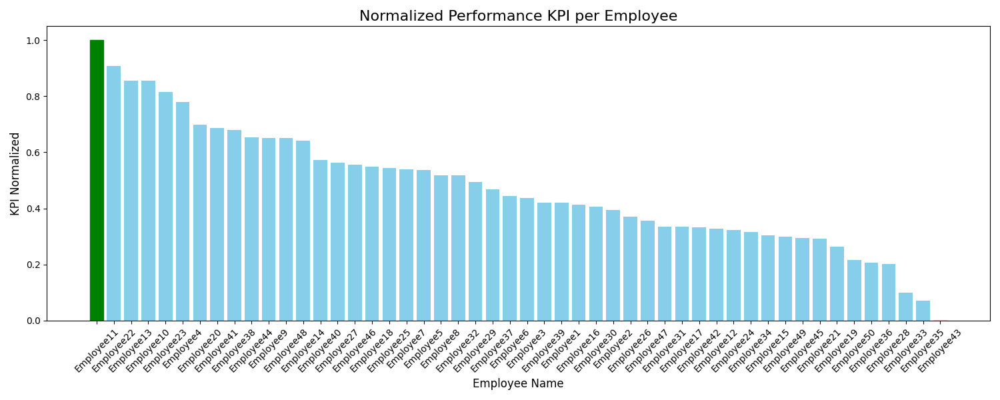
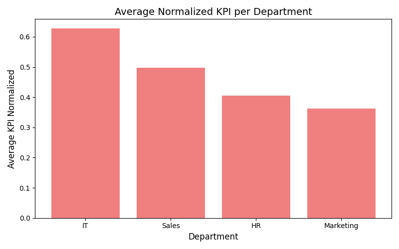
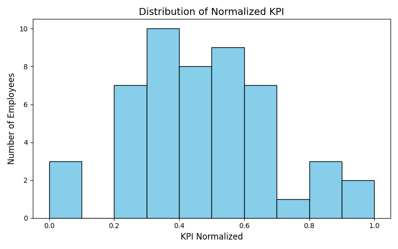

# Employee Performance Analysis – KPI Calculation & Visualization

## Project Overview
This project simulates and analyzes the performance of 50 employees across different departments (Sales, Marketing, IT, HR).  
The dataset includes:

- **TasksCompleted**: Number of tasks completed by each employee  
- **HoursWorked**: Total hours worked  
- **SatisfactionScore**: Employee satisfaction score  

The main goal is to **calculate Performance KPIs, normalize them, identify top/bottom performers, and visualize insights**.

---

## Skills Demonstrated

- **Data Cleaning**: Handling missing values and incorrect data (negative hours)  
- **KPI Calculation**: Compute performance indicators based on tasks, hours, and satisfaction  
- **Data Normalization**: Scale KPI values for comparison  
- **Analysis & Insights**: Identify best and worst performing employees  
- **Visualization**: Bar charts, department averages, and KPI distribution  
- **Python Libraries**: pandas, numpy, matplotlib, openpyxl  

---

## Steps Performed

1. **Data Preparation**  
   - Created a synthetic dataset of 50 employees  
   - Randomly assigned departments, tasks completed, hours worked, and satisfaction scores  

2. **Data Cleaning**  
   - Filled missing values with column averages  
   - Converted negative working hours to positive  

3. **KPI Calculation**  
   - Formula: `PerformanceKPI = (TasksCompleted / HoursWorked) * SatisfactionScore`  
   - Normalized KPI: scaled between 0 and 1 for comparison  

4. **Analysis**  
   - Identified best and worst performing employees  
   - Calculated average KPI per department  

5. **Visualization**  
   - Employee-wise normalized KPI bar chart (highlighted best & worst)  
   - Department-wise KPI bar chart  
   - Histogram of KPI distribution  

6. **Export**  
   - Saved final cleaned dataset with KPI to CSV (`employee_performance_with_KPI.csv`)  

---

## Key Insights

- The best performing employee can be easily identified via KPI  
- Department-wise KPI helps understand which department is performing best  
- Histogram shows overall performance distribution across all employees  

---

## Usage

1. Clone this repository  
2. Install dependencies: `pandas`, `numpy`, `matplotlib`, `openpyxl`  
3. Run `employee_performance_analysis.py`  
4. View the generated visualizations and CSV output  

---
## Visualizations

## Conclusion

This project demonstrates **data cleaning, KPI calculation, and visualization skills** for a Junior Data Analyst.  
It’s a clear example of turning raw data into actionable insights.

---

